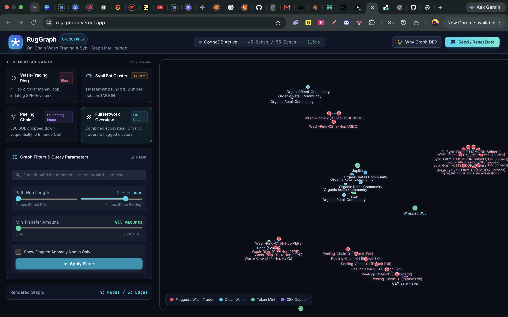
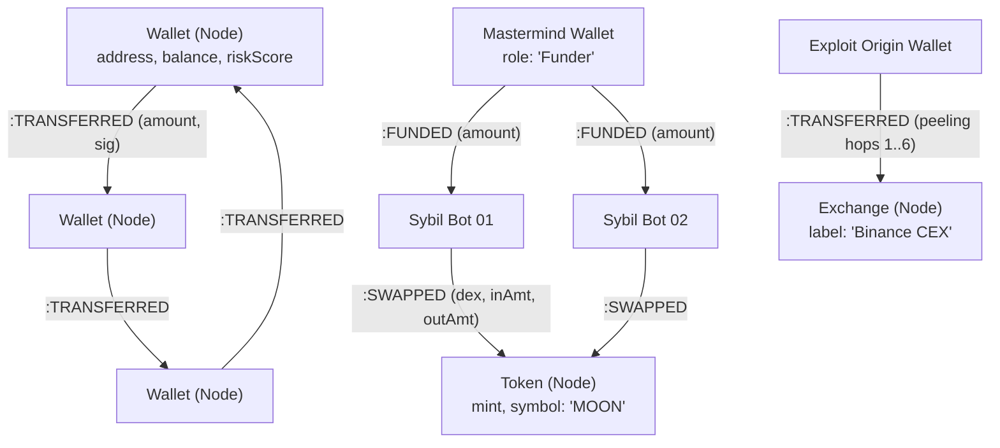

# RugGraph — On-Chain Wash-Trading & Sybil Graph Intelligence

> **Full-Stack Graph Intelligence Platform for detecting Wash-Trading Rings, Sybil Clusters, and Peeling Chains using CognoDB, NestJS, and React.**

---

## Live Deployment & Links

* **Live Interactive Frontend:** [https://rug-graph.vercel.app](https://rug-graph.vercel.app)
* **Live Backend API (Render):** [https://ruggraph.onrender.com](https://ruggraph.onrender.com)
* **Backend Health Check:** [https://ruggraph.onrender.com/health](https://ruggraph.onrender.com/health)
* **GitHub Repository:** [https://github.com/Patoski-patoski/rugGraph](https://github.com/Patoski-patoski/rugGraph)
* **Video Walkthrough:** *(Add your 1–2 min Loom / recording link here)*

---

## UI & Forensics Dashboard Preview



---

## 🧠 Why a Graph Database?

> 💡 **New to on-chain forensics or blockchain terminology?** Check out the [📖 Blockchain Forensics & On-Chain Crime Primer](notes.md) for plain-English explanations of Wash Trading, Sybil Bot Farms, Peeling Chains, and financial crime terminology.

Blockchain transaction ledgers are inherently interconnected graphs of wallets, tokens, liquidity pools, and smart contracts. When performing forensic analysis, the central questions are about **topologies, cycles, and multi-hop paths of arbitrary depth**:

1. **Circular Wash Trading:** Discovering whether funds cycle through $N$ intermediaries back to the origin wallet (`A → B → C → D → A`) to fake token trading volume.
2. **Sybil Fan-Out Trees:** Detecting when a single mastermind wallet funds dozens of disposable puppet wallets that simultaneously snipe a token launch.
3. **Laundering Peeling Chains:** Tracing large balances broken down sequentially across 5+ intermediary hops before entering centralized exchange (CEX) deposit addresses.

### Relational Database (SQL) vs Graph Database (CognoDB / openCypher)

| Feature | Relational Schema (PostgreSQL / MySQL) | CognoDB Graph (openCypher) |
| :--- | :--- | :--- |
| **Multi-Hop Traversal** | Requires expensive, fragile `WITH RECURSIVE` CTEs or cascading table self-joins (`JOIN transfers t1 ... JOIN transfers t2 ...`) | Declarative variable-length path pattern matching: `[:TRANSFERRED*2..6]` |
| **Cycle Detection** | High exponential complexity, risk of infinite recursion loops in SQL queries | Built-in node equality path constraints: `(w)-[:TRANSFERRED*2..5]->(w)` executed in milliseconds |
| **Traversal Performance** | $O(N \log N)$ index lookups on foreign keys for every single hop | **Index-free adjacency**: Direct memory pointer traversals in $O(k)$ time |
| **Schema Flexibility** | Rigid relational join tables (`wallet_transfers`, `token_swaps`, `cex_deposits`) | Flexible labeled property graph (`:Wallet`, `:Token`, `:Exchange`) with typed edges |

---

## Graph Data Model



### Nodes

* **`:Wallet`** — `{ address: string, label: string, balance: number, riskScore: number, isFlagged: boolean, clusterTag?: string, role?: string, firstSeen: string, lastSeen: string }`
* **`:Token`** — `{ mint: string, symbol: string, name: string, decimals: number, label: string }`
* **`:Exchange`** — `{ address: string, name: string, label: string, clusterTag: string, role: 'Exchange' }`

### Relationships

* **`[:TRANSFERRED { amount: number, tokenSymbol: string, signature: string, timestamp: string }]`** — Peer-to-peer wallet transfers.
* **`[:SWAPPED { inputAmount: number, outputAmount: number, dex: string, signature: string, timestamp: string }]`** — DEX token trades.
* **`[:FUNDED { amount: number, tokenSymbol: string, signature: string, timestamp: string }]`** — Initial wallet activation/funding edges.

---

## Core Cypher Queries Explained

All queries are executed using **parameterized inputs** via the official `neo4j-driver` (no raw string concatenation).

### 1. Multi-Hop Circular Wash-Trading Ring Detector

Finds circular money paths where funds loop through 2 to 5 intermediary wallets back to the origin address, calculating total artificial volume:

```cypher
MATCH path = (w:Wallet)-[:TRANSFERRED*2..5]->(w)
WHERE ALL(rel IN relationships(path) WHERE rel.amount >= $minAmount)
WITH path, nodes(path) AS ringNodes, relationships(path) AS ringRels, length(path) AS hopCount
RETURN 
  head(ringNodes).address AS originAddress,
  hopCount,
  [n IN ringNodes | n] AS rawNodes,
  [r IN ringRels | r] AS rawRels,
  reduce(total = 0.0, r IN ringRels | total + r.amount) AS totalVolume,
  head(ringRels).tokenSymbol AS tokenSymbol
ORDER BY totalVolume DESC, hopCount ASC
LIMIT $limit
```

### 2. Sybil Fan-Out & Token Sniping Cluster Discovery

Detects a central funder dispersing capital to $N$ disposable puppet wallets that all execute swaps on a target token contract:

```cypher
MATCH (funder:Wallet)-[f:FUNDED|TRANSFERRED]->(sybil:Wallet)-[s:SWAPPED]->(t:Token)
WHERE ($targetSymbol IS NULL OR t.symbol = $targetSymbol)
WITH funder, t, collect(DISTINCT sybil) AS sybilList, collect(DISTINCT f) AS fundingRels, collect(DISTINCT s) AS swapRels
WHERE size(sybilList) >= $minWallets
RETURN 
  funder,
  t,
  size(sybilList) AS sybilCount,
  sybilList,
  fundingRels,
  swapRels,
  reduce(total = 0.0, r IN fundingRels | total + r.amount) AS totalFundedAmount
ORDER BY sybilCount DESC
LIMIT $limit
```

### 3. Laundering Peeling-Chain Traversal

Identifies sequential fund routes where an origin balance is peeled down across intermediary hops before landing at an exchange safe haven:

```cypher
MATCH path = (origin:Wallet)-[:TRANSFERRED*3..6]->(dest)
WHERE (dest:Exchange OR dest.role = 'Exchange' OR dest.clusterTag CONTAINS 'CEX')
  AND head(relationships(path)).amount >= $minStartAmount
WITH path, nodes(path) AS chainNodes, relationships(path) AS chainRels, length(path) AS hopCount
RETURN 
  head(chainNodes).address AS originAddress,
  last(chainNodes).address AS destinationAddress,
  last(chainNodes).label AS destinationLabel,
  head(chainRels).amount AS startAmount,
  last(chainRels).amount AS finalAmount,
  hopCount,
  [n IN chainNodes | n] AS rawNodes,
  [r IN chainRels | r] AS rawRels
ORDER BY startAmount DESC
LIMIT $limit
```

---

## ⚡ Quickstart & Setup Guide

### 1. Provision Free CognoDB Cloud Database

1. Go to [https://console.cognodb.com/signup](https://console.cognodb.com/signup) and create an account (no credit card required).
2. Create a free **(c0)** instance and copy:
   * **Bolt URI:** `bolt+s://<instance-id>.databases.cognodb.cloud`
   * **User:** `cognodb`
   * **Password:** `<your-generated-password>`

### 2. Configure Environment Variables

Copy `.env.example` in `backend/` to `backend/.env` and insert your CognoDB credentials:

```bash
cp backend/.env.example backend/.env
```

```env
NODE_ENV=development
PORT=4000
COGNODB_URI=bolt+s://<instance-id>.databases.cognodb.cloud
COGNODB_USER=cognodb
COGNODB_PASSWORD=<your-cognodb-password>
CORS_ORIGIN=http://localhost:5173
```

### 3. Install Dependencies & Run

Using **Bun**:

```bash
# Install root, backend, and frontend dependencies
bun install
cd backend && bun install && cd ../frontend && bun install && cd ..

# Run backend & frontend concurrently
bun run dev
```

* **Frontend:** [http://localhost:5173](http://localhost:5173)
* **Backend API:** [http://localhost:4000](http://localhost:4000)
* **Health Endpoint:** [http://localhost:4000/health](http://localhost:4000/health)

### 4. Seed the Graph Database

You can populate the database in two ways:

1. **Via the UI:** Click the **"Seed / Reset Data"** button in the top navigation bar.
2. **Via CLI:** Run `bun run seed` from the root or `backend/` directory.

---

## 🧪 Testing

The backend includes comprehensive unit tests verifying TypeBox DTO validation, path range bounds, and Cypher query result parsing:

```bash
# Run unit tests
bun run test
```

---

## Project Structure

```markdown
rugGraph/
├── backend/
│   ├── src/
│   │   ├── common/
│   │   │   ├── exceptions/       # Typed domain exceptions (Database, Graph)
│   │   │   ├── filters/          # Global unified exception filter
│   │   │   └── pipes/            # TypeBox schema validation pipe
│   │   ├── config/               # TypeBox validated environment config
│   │   ├── database/             # CognoDB (neo4j-driver) wrapper & health check
│   │   ├── graph/                # Cypher query services, DTOs & controllers
│   │   ├── seed/                 # Deterministic synthetic seed generator & CLI
│   │   ├── app.controller.ts     # Health and metadata endpoints
│   │   ├── app.module.ts
│   │   └── main.ts
│   ├── tsconfig.json
│   └── package.json
├── frontend/
│   ├── src/
│   │   ├── components/
│   │   │   ├── GraphCanvas.tsx       # 2D Canvas Force-Directed graph with particle flows
│   │   │   ├── ScenarioSelector.tsx  # 1-Click forensic preset switcher
│   │   │   ├── FilterPanel.tsx       # Hop range, volume slider & search
│   │   │   ├── NodeDrawer.tsx        # Slide-over wallet/token inspector
│   │   │   ├── WhyGraphModal.tsx     # Graph DB vs SQL educational comparison
│   │   │   ├── SeedModal.tsx         # In-app dataset seeder and database wiper
│   │   │   └── Navbar.tsx            # Live CognoDB health & metrics
│   │   ├── services/api.ts           # Typed backend client
│   │   ├── types/graph.ts
│   │   ├── App.tsx
│   │   └── main.tsx
│   ├── vite.config.ts
│   └── tailwind.config.js
├── AGENTS.md                         # Project engineering rules & conventions
└── README.md
```
